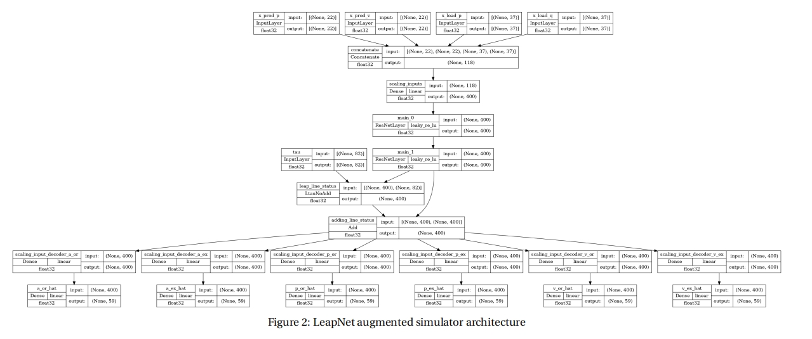

## Environment configuration

You can find all the detail about environment installation in the `1_PowerGrid_UseCase_basics.ipynb`

You need to replace the source code for `PowerGridScaler` entire class in line 973 of `main.py` with code for `new scaler.py`

## How to run

You can run 

>python -u main.py

or

> nohup python -u main.py > out.log 2>&1 &

## Scheme introduction

**Data Preprocessing**: 

It involves using functions like get_YBus_all_tensor() to obtain the YBus matrix for admittance and circuit relationships. The data includes various attributes like prod_p, load_p, etc. , and only utilizes certain properties (obs) such as gen_to_subid, load_to_subid, etc.

**Neural Network Structure**: 

The LEAPNet structure is described with multiple input and output layers and specific operations. It references related works like the LIPS - learning industrial physical simulation benchmark suite.

**Loss Function Design**: 

The total loss is composed of 100*MSE and several other components related to the physical constraints. The design details of each component like current positivity, voltage positivity, etc., are provided, along with their calculations and effectiveness. There are also discussions on new attempts and their effects on accuracy.

**Hard Linear Equality Constraints**: 

The KKT-hPINN method is introduced with equations and derivations. The relationship between different constraints like P7 and global conservation is discussed, along with the challenges in combining certain constraints and the need for further improvement.

