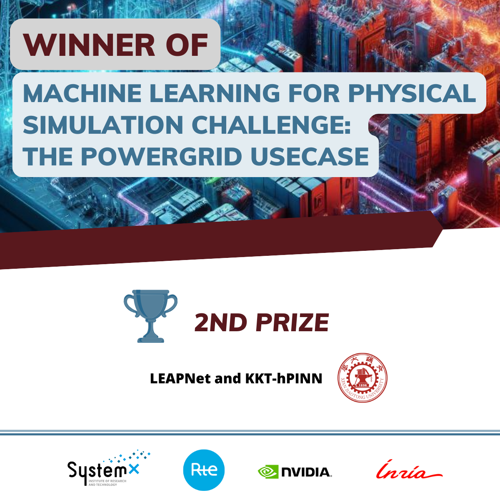

# Introduction

In order to achieve the goal of the competition "[Machine Learning for Physical Simulation Challenge - powergrid use case](https://www.codabench.org/competitions/2378/), we propose the LEAPNet and KKT-hPINN method (abbreviated as LEAP-PINN) and acheive the second prize. This repository is source of LEAP-PINN.

Here is the LinkedIn post about the result of the competition: [LinkedIn](https://www.linkedin.com/posts/institut-de-recherche-technologique-systemx_machine-learning-for-physical-simulation-activity-7264587187126517760-ZhgC/?utm_source=share&utm_medium=member_desktop)

## Competition Overview

**Background:** Renewable energies such as solar and wind need to be massively integrated into the power grid to achieve decarbonization, which brings complex new operational challenges.

**Industrial Challenge:** Due to their intermittency, many more scenarios need to be studied to mitigate risks near real-time, thus keeping the grid safe without cascading failures. In particular, the operators need to anticipate what could happen in terms of congestion on the grid in case some unexpected outage occurs on some power lines under different wind and solar conditions. Hence, the need for power flow simulation is exploding at least 1000-fold in control rooms.

**Objective:** This competition aims to unlock new methods for speeding up these simulations by several orders of magnitude while ensuring some realistic criteria in order to run this more complex risk assessment tomorrow. The proposed method will be applied on a small grid with 30% wind and solar, as expected on the French grid in the near future.

To evaluate the solutions in the competition, we rely on our recently proposed benchmarking framework called [LIPS](https://proceedings.neurips.cc/paper_files/paper/2022/hash/b3ac9866f6333beaa7d38926101b7e1c-Abstract-Datasets_and_Benchmarks.html) (Learning Industrial Physical Systems). This framework will be used to evaluate candidate solutions provided by the participants regarding significant criteria organized into four categories, namely ML-related criteria, Physical Compliance criteria, industrial readiness, and out-of-distribution (OOD) generalization criteria. For each submitted solution, a global score will be computed based on the aforementioned criteria to rank it. More details concerning the computation of the score are provided on the evaluation page in [the starting kit repository](https://github.com/IRT-SystemX/ml4physim_startingkit_powergrid).

### Criteria

For each above-mentioned category, specific criteria related to the power flow prediction task are defined as follows:

## LEAP-PINN 

LEAP-PINN method is mainly inspired by the LEAPNet model ([ARXIV: LEAP nets for power grid perturbations](https://arxiv.org/abs/1908.08314)) and the KKT-hPINN method ([ARXIV: Physics-Informed Neural Networks with Hard Linear Equality Constraints](https://arxiv.org/abs/2402.07251)).

## Environment configuration

You can find all the details about environment installation in `1_PowerGrid_UseCase_basics.ipynb`

**\*For brevity, this git repository does not contain all the data. Please refer to `2_Dataset.ipynb` to download the complete data.**
After you have downloaded the complete data, please replace the source codes of `PowerGridScaler()` function started at line 973 of `main.py` with codes in `new scaler.py`. If you use an IDE, you can hold `ctrl` and click the `PowerGridScaler()` to find its source code.

## How to run

You can run 

>python -u main.py

or

> nohup python -u main.py > out.log 2>&1 &

## Scheme introduction

**Data Preprocessing**: 

- It involves using functions like get_YBus_all_tensor() to obtain the YBus matrix for admittance and circuit relationships. The data includes various attributes like prod_p, load_p, etc. , and only utilizes certain properties (obs) such as gen_to_subid, load_to_subid, etc.

**Neural Network Structure**: 

- The LEAPNet structure contains multiple input and output layers and specific operations. Based on our understanding of LEAPNet, we rewrote the LEAPNet code from TensorFlow to PyTorch.

**Loss Function Design**: 

- Focusing on prediction accuracy, the team adjusted the MSE (Mean Square Error) weight to 100 and incorporated P1, P2, P3, P5, and P8 into the loss function.

**Hard Linear Equality Constraints**: 

- In dealing with hard constraints, we explored the KKT-hPINN method. We initially aimed to apply it to both P4 and P7, using P7's local conservation to achieve global conservation in P6. However, due to the high resource intensity of handling P4 with this method, we had to make compromises. We ultimately adopted the approach of directly setting the power of disconnected lines to zero for P4, which unfortunately led to conflicts with P7.

---

Contact us: Qingbin Jiang jqb0704@outlook.com  & Prof. Yang Liu yangliu@xjtu.edu.cn 
