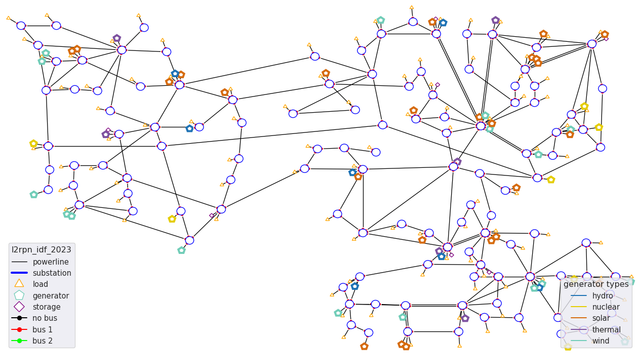
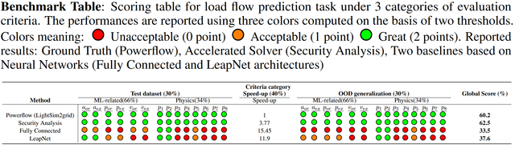
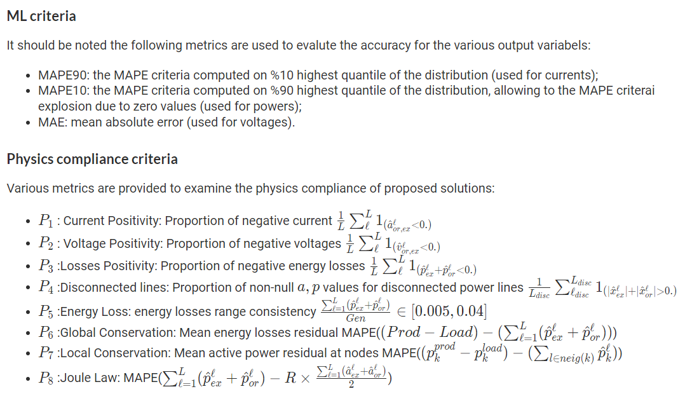

# Introduction

This is the code for the competition "Machine Learning for [Physical Simulation Challenge - powergrid use case](https://www.codabench.org/competitions/2378/).  In order to achieve the goal of the competition, we propose the LEAP-PINN method.  And in the competition, we finished second in it.

Here is the LinkedIn post about the result of the competition: [LinkedIn](https://www.linkedin.com/posts/institut-de-recherche-technologique-systemx_machine-learning-for-physical-simulation-activity-7264587187126517760-ZhgC/?utm_source=share&utm_medium=member_desktop)

The overview of the competition is followed.

## Competition overview

**Context:** To tackle climate change, renewables energies such as solar and wind need to be massively integrated in the years to come into the power grid to achieve decarbonation. This brings complex new operational challenges.

**Industrial Challenge:** Due to their intermittency, many more scenarios need to be studied to mitigate risks near real-time to keep the grid safe without cascading failures. In particular, the operators need to anticipate what could happen in terms of congestions on the grid in case some unexpected outage occurs on some power lines under different wind and solar conditions. Hence the need for powerflow simulation is exploding at least 1000-fold in control rooms.

**Objective:** This competition aims at unlocking new methods for speeding-up these simulations by several order of magnitude, while ensuring some realistic criteria, in order to run this more complex risk assessment tomorrow. You will apply this on a grid of similar size of one controlled by a human operator with an energy mix that include 30% wind and solar as expected on the French grid in the near future.

To evaluate the solutions, the competition rely on our recently proposed benchmarking framework called LIPS (Learning Industrial Physical Systems). This framework will be used to evaluate candidate solutions provided by the participants regarding significant criteria organized into 4 categories namely: ML related criteria, Physical Compliance criteria, industrial readiness and OOD generalization criteria. For each submitted solution, a global score will be computed based on the aforementioned criteria to rank it. More details concerning the computation of score is provided in Evaluation page in the left panel and also in starting kit repository.

### Criteria

For each above mentioned category, specific criteria related to the power grid load flow prediction task are defined:

## LEAP-PINN 

LEAP-PINN method is mainly based on LEAPNet model([ARXIV: LEAP nets for power grid perturbations](https://arxiv.org/abs/1908.08314)) and KKT-hPINN([ARXIV: Physics-Informed Neural Networks with Hard Linear Equality Constraints](https://arxiv.org/abs/2402.07251)).  You can go to the corresponding arxiv website by clicking on the name of the paper.

We rewrote the LEAPNet code from TensorFlow to PyTorch. This was a team decision based on our proficiency with PyTorch, enabling us to work more efficiently.

## Environment configuration

You can find all the detail about environment installation in the `1_PowerGrid_UseCase_basics.ipynb`

**\*This git repository does not contain all the data, please refer to `2_Dataset.ipynb` to download the complete data.**

You need to replace whole source code of `PowerGridScaler()`  in line 973 of `main.py` with code `new scaler.py`. You can hold `ctrl` to click the `PowerGridScaler()` to find the source code. Delete it and refill it with the code in `new scaler.py`.

## How to run

You can run 

>python -u main.py

or

> nohup python -u main.py > out.log 2>&1 &

## Scheme introduction

**Data Preprocessing**: 

It involves using functions like get_YBus_all_tensor() to obtain the YBus matrix for admittance and circuit relationships. The data includes various attributes like prod_p, load_p, etc. , and only utilizes certain properties (obs) such as gen_to_subid, load_to_subid, etc.

**Neural Network Structure**: 

The LEAPNet structure is described with multiple input and output layers and specific operations. It references related works like the LIPS - learning industrial physical simulation benchmark suite.

**Loss Function Design**: 

The total loss is composed of 100*MSE and several other components related to the physical constraints. The design details of each component like current positivity, voltage positivity, etc., are provided, along with their calculations and effectiveness. There are also discussions on new attempts and their effects on accuracy.

**Hard Linear Equality Constraints**: 

The KKT-hPINN method is introduced with equations and derivations. The relationship between different constraints like P7 and global conservation is discussed, along with the challenges in combining certain constraints and the need for further improvement.

---

Contact us: Qingbin Jiang jqb0704@outlook.com  & Prof. Yang Liu yangliu@xjtu.edu.cn 
